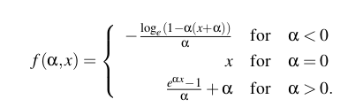
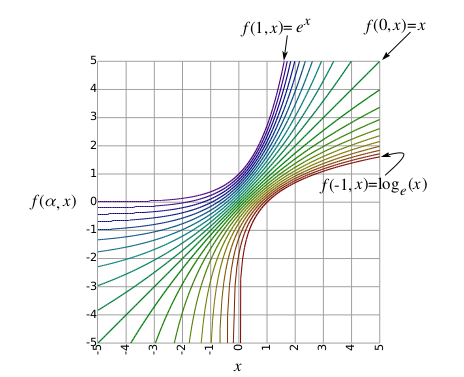
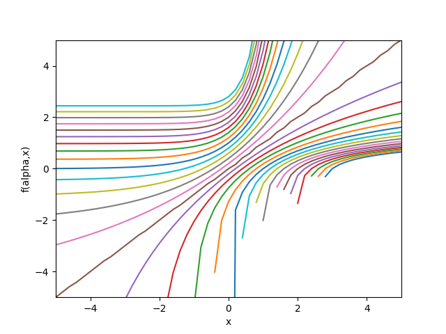

# Soft-exponential-activation-function-research-paper-implementation-

Implementation of parameterized soft-exponential activation function on MNIST dataset. In this implementation, the parameters are the same for all neurons initially starting with 1. The soft-exponential function is a good choice for neural networks that have a lot of connections and a lot of neurons.

This activation function revolves around logarithmic, linear and exponential behaviour.

The equation for the soft-exponential function is:

   

# Problems faced:

## 1. Misinformation about the function

From a paper by [A continuum among logarithmic, linear, and exponential functions, and
its potential to improve generalization in neural networks](https://arxiv.org/pdf/1602.01321.pdf#:~:text=Abstract%3A%20We%20present%20the%20soft,of%20the%20network%20is%20trained.), here in Figure 2, the soft-exponential function is shown as a logarithmic function. This is not the case.

The real figure should be shown here:

Here we can see in some cases the soft-exponential function is undefined for some values of (alpha,x), (alpha,x) is not a constant.

## 2. Negative values inside logarithm

Here comes the tricky part. The soft-exponential function is defined for all values of alpha and x. However, the logarithm is not defined for negative values.

In the issues under [Keras](https://github.com/keras-team/keras/issues/3842), one of the person has suggested to use the  inverse function of sinh() instead of the log().

## 3. Initialization of alpha

Starting with an initial value of 1, the soft-exponential function was steep at the beginning and it is more gradual at the end. This was a good idea.

# Acknowledgements:

- [A continuum among logarithmic, linear, and exponential functions, and
its potential to improve generalization in neural networks (Research paper)](https://arxiv.org/pdf/1602.01321.pdf#:~:text=Abstract%3A%20We%20present%20the%20soft,of%20the%20network%20is%20trained.)

- [Keras issues 3842](https://github.com/keras-team/keras/issues/3842)
